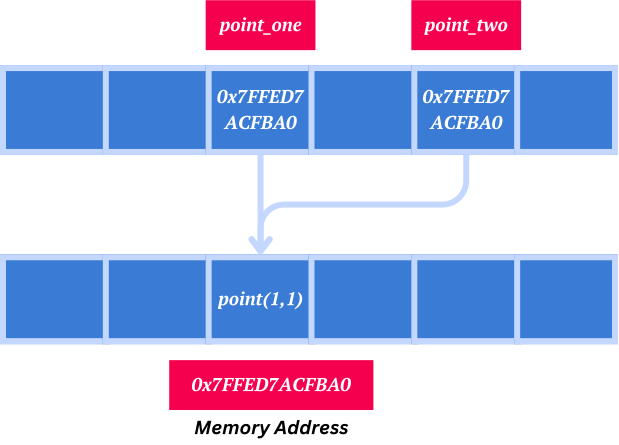

# Variables

Variables are used to store data or values that can be referenced and manipulated throughout a program.

example:

```java
String welcomeMsg = "Hello World!";
```

- The keyword `String` declares a variable that can store a **sequence of characters** (text).
- `welcomeMsg` is the name of the variable, also called an `identifier`.
- The = sign is the **assignment operator**; it assigns the value on the right side ("Hello World!") to the variable on the left (`welcomeMsg`).

# Types

Types define the kind of data that can be stored in a variable. **Java is a strongly-typed language**, **meaning every variable must be declared with a type before it is used**. 
Java has two main categories of data types:

## Primitive Data Types

Primitive data types hold actual values and are stored directly in memory.

| Type    | Size   | Range                                                                         | Default Value  |
|---------|--------|-------------------------------------------------------------------------------|----------------|
| byte    | 8-bit  | -128 to 127                                                                   | 0              |
| short   | 16-bit | -32,768 to 32,767                                                             | 0              |
| int     | 32-bit | -2^31 to 2^31 - 1 (about -2 billion to +2 billion)                            | 0              |
| long    | 64-bit | -2^63 to 2^63 - 1                                                             | 0L             |
| float   | 32-bit | Fractional numbers (store approximately 7 decimal digits of precision)        | 0.0f           |
| double  | 64-bit | Fractional numbers (store approximately 15 to 16 decimal digits of precision) | 0.0d           |
| boolean | 1-bit  | true or false                                                                 | false          |
| char    | 16-bit | A single Unicode character                                                    | \u0000         |

- Whole numbers are treated as int unless specified otherwise.
- Decimal numbers are treated as double unless specified otherwise.

## Reference (Non-Primitive) Data Types

Reference data types in Java refers to an objects and arrays. They do not hold the actual value but store references (memory addresses) pointing to where the object data is stored in memory.
Some of the main reference types in Java.

- Classes
- Arrays
- Strings
- Interfaces
- Enums



# Strings
 
Strings is actually an object and part of the **reference types** category. String in Java is an object of the `java.lang.String` class.

```java
String myName = "Vini";
```

This creates a String object containing "Vini" and stores a reference to this object in the variable `myName`.
When you create a String, Java does not store the actual characters directly in the variable (like with primitive types such as int or char).
Instead, it stores a **reference** (a memory address) pointing to where the String object is stored in memory.

If you do something like:

```java
String anotherName = name;
```

Now, anotherName and myName both hold references to the same String object in memory.

## String's Immutability

String objects are **immutable**, meaning that once a String object is created, its value cannot be changed. 
Any operation that seems to modify a String actually results in the creation of a new String object.

When you assign a new value to a String variable, the reference is updated to point to a new 
String object rather than modifying the existing object.